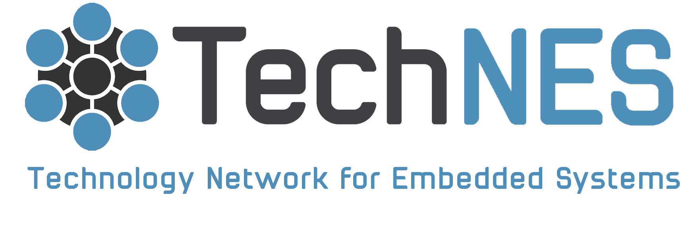

Welcome to the landing page for the TechNES Best Practices in Artificial Intelligence working group.

## Mission Statement

> To be the go-to place for advice and guidance on applications of AI and ML to electronic systems engineers.

As a group, we aim to provide high quality guidance on AI for electronic systems engineers by providing supporting material, guides, and workshops.

## Current Work
Our group currently maintains:
  - A Github [wiki](https://github.com/TechNES-UK/ai-observatory/wiki) providing an an observatory on existing material related to Best Practices in Artificial Intelligence
  - A written [guide](https://github.com/TechNES-UK/best_practice_for_ai) on best practices in Ai for electronic systems engineers. This is maintained in [reStructuredText](https://docutils.sourceforge.io/rst.html).

### Get Involved
We welcome all contributions to this project. If you wish to contribute please get in touch with us, or open a pull request.
